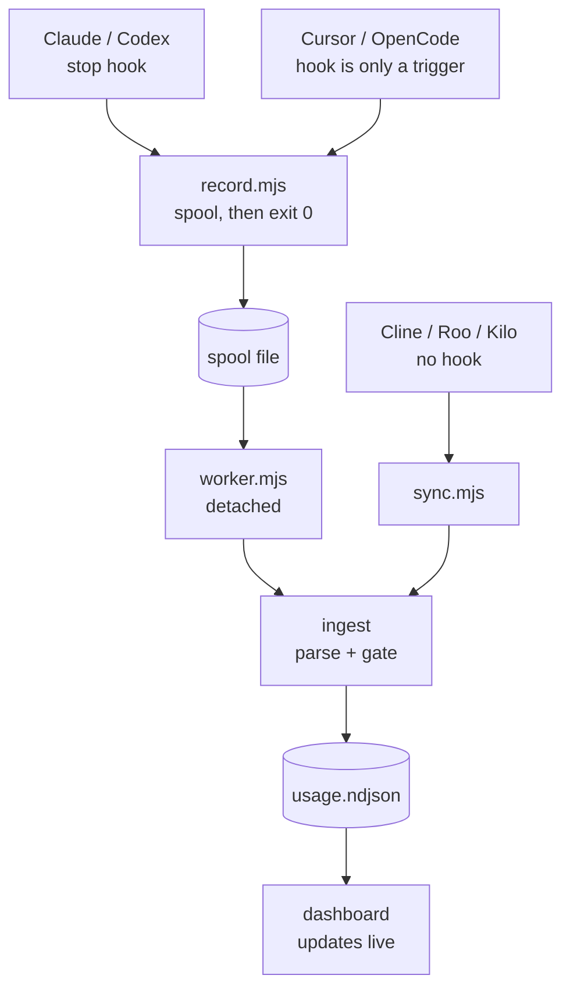
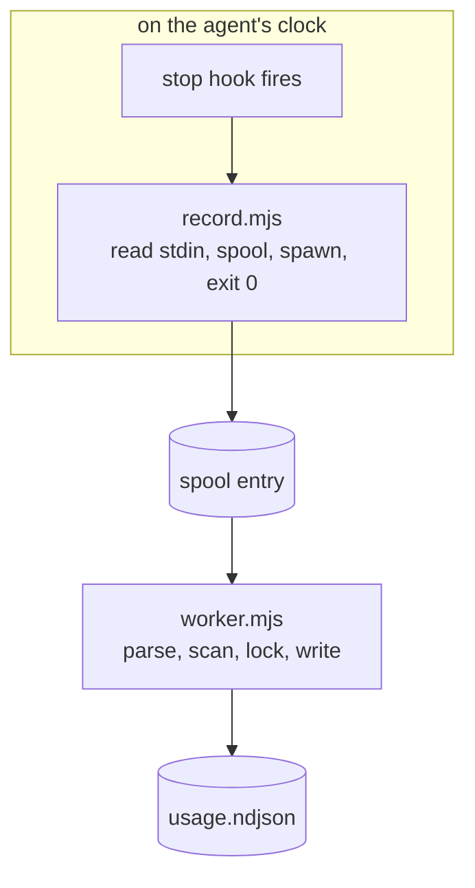

<div align="center">

# AI Usage Inspector

**Record every AI coding-agent prompt — tokens, model, context %, and cost — then explore it in one local dashboard.**


</div>

---

Your coding agent spends tokens on every prompt. This records what each one actually cost —
locally, in the project it happened in — and gives that project its own dashboard.

It tracks **Claude Code**, **OpenAI Codex**, **Cursor**, **OpenCode**, and the VS Code
agents **Cline**, **Roo Code**, and **Kilo Code**, and normalizes them into one record
shape so they sit side by side in the same table.



Two ways in, one way through: a live turn is captured the moment an agent stops, history
already on disk is imported by sync, and both meet at the same ingest step.

## Features

- **Multi-agent, one table** — seven agents side by side, with provider filters, badges, charts, and cost/token splits.
- **Per-prompt detail** — prompt and response text, input/output/cache/reasoning tokens, model, permission mode, context fill %, USD cost, duration, first-response latency, skills, and tool/subagent counts where the agent exposes them.
- **Never blocks your agent** — the hook spools the payload and exits; a detached worker does the parsing and writing.
- **Yours, locally** — records live in your project, tracking can be turned off per project, and whole field groups (including the prompt text) can be stripped before anything is written.
- **Live dashboard** — the page follows the data as it is recorded, with full-text search, CSV/JSON export, and an optional monthly budget.
- **Zero dependencies, zero build** — pure Node built-ins and vanilla browser JS, covered by 88 tests.

## Quick start

```sh
npx -y github:Kud0o/ai-usage-inspector
```

That auto-detects the agents you have installed and registers each hook it can. Then just
use your agent — each project becomes self-contained, with its data, its own copy of the
viewer, and your saved view settings in `<project>/.ai-usage/`. To look:

```sh
cd <your project>
node .ai-usage/viewer/server.mjs   # -> http://localhost:4317
```

Add `.ai-usage/` to that project's `.gitignore` so the records are not committed.

```sh
npx -y github:Kud0o/ai-usage-inspector --update      # upgrade
npx -y github:Kud0o/ai-usage-inspector --uninstall   # remove the hooks
```

## Supported agents

| Agent | Where the numbers come from | Registered in | Notes |
|---|---|---|---|
| Claude Code | `~/.claude/projects/.../*.jsonl` | `~/.claude/settings.json` | Exact usage, streamed-message dedupe, subagent attribution, skills |
| OpenAI Codex | `~/.codex/sessions/.../rollout-*.jsonl` | `~/.codex/hooks.json` | Cumulative token deltas per turn |
| Cursor | `state.vscdb` SQLite stores | `~/.cursor/hooks.json` | Needs Node >= 22.5. Estimates tokens when Cursor stores no exact counts |
| OpenCode | `~/.local/share/opencode/opencode.db` | `~/.config/opencode/plugins/` | Needs Node >= 22.5. Exact tokens **and cost from its own database** |
| Cline · Roo · Kilo | `<VSCode>/User/globalStorage/<extId>/tasks/` | none — scan only | Exact tokens + cost. VS Code extensions cannot run a turn-end hook, so these are captured on sync |

**Requirements:** Node >= 18, or >= 22.5 for Cursor and OpenCode (they are read from SQLite
via the built-in `node:sqlite`).

> **Antigravity** and **GitHub Copilot** are detected but not supported: both keep usage
> server-side, and Antigravity encrypts its local conversations, so there is nothing on
> disk to read.

## Installing

```sh
node install.mjs                  # every detected agent
node install.mjs --claude         # or one at a time: --codex --cursor --opencode
node install.mjs --cline          #                   --roo --kilo
node install.mjs --local          # Claude Code, this project only
node install.mjs --sync           # install, then import existing history
node install.mjs --dashboard      # one dashboard across every project
node install.mjs --uninstall      # remove the hooks
```

The installer copies the app to `~/.ai-usage-inspector/app/` and registers each agent's
hook in that agent's own config. Entries are marked, so uninstall removes only this tool's
hook and leaves your settings — including your own hooks — untouched.

After installing Codex tracking, open `/hooks` in Codex and trust the hook. Codex
deliberately skips new or changed command hooks until their definition is reviewed.

### Importing history you already have

Hooks only record from install time forward. To import what the agents already have on disk:

```sh
node ~/.ai-usage-inspector/app/src/sync.mjs                      # everything
node ~/.ai-usage-inspector/app/src/sync.mjs --provider codex --days 30
node ~/.ai-usage-inspector/app/src/sync.mjs --reprice            # recompute stored costs
```

Sync is idempotent — records upsert per session, so re-running never duplicates — and it
respects each project's tracking setting. Records you deleted in the dashboard stay
deleted: a tombstone is kept per record, and sync honours it.

## The dashboard

```sh
node .ai-usage/viewer/server.mjs                 # first free port from 4317
node .ai-usage/viewer/server.mjs --port 8080
```

- **Summary cards** — prompts, tokens, active time, first-response latency, top model, busiest workspace, this-month cost against an optional budget.
- **Charts** — tokens over time, context-fill distribution, permission mode, prompts by model, skills invoked, cost per day, and per-provider splits.
- **Filter bar** — provider, workspace, model, mode, effort, date, minimum context %, and free-text search. Export the filtered view as CSV or JSON.
- **Table and detail drawer** — grouped by workspace → session → prompt, with rendered Markdown, usage, timing, cost, and metadata per turn.
- **Settings** — per project: tracking on/off, which field groups to store, monthly budget.
- **Delete** — remove the filtered records or a single prompt, with confirmation and the disk space freed.

Search matches the **whole stored prompt and response**, not the 280-character preview the
table shows, and JSON export contains the complete records. The page subscribes to a change
feed and refreshes itself as the worker records new turns.

> The dashboard serves your prompt text and exposes a delete API, so it binds to
> `127.0.0.1`. Set `AI_USAGE_HOST` only if you deliberately want it reachable from your
> network.

## Where your data lives

Everything for a project stays inside that project:

```text
<project>/.ai-usage/
|-- usage.ndjson     one JSON record per prompt
|-- tombstones.json  records you deleted, so a later sync cannot bring them back
|-- config.json      tracking, stored fields, and saved view settings
`-- viewer/          a copy of the dashboard; run it in place
```

Machine-wide state lives once, outside your projects, in `~/.ai-usage-inspector/`: the
installed `app/`, the hook `spool/` (normally empty), `scan-state.json`, and cached pricing
tables. Nothing is written into the agents' own directories, and nothing leaves your
machine.

**Tracking is on by default and per project.** Turn it off, or strip whole field groups —
`text` (the prompt and response themselves), `tokens`, `cost`, `context`, `timing`,
`skills`, `counts`, `meta` — from that project's dashboard settings or its `config.json`. A
disabled group is stripped *before* anything is written. See
[configuration in depth](docs/internals.md#configuration-in-depth).

**Combined dashboard:** point `AI_USAGE_DIR` at a shared folder, for both the hook and the
viewer, to pool every project into one dashboard.

## Why it does not slow your agent down

A stop hook runs on the agent's clock, so this one does almost nothing:



Only the boxed step is time the agent pays for. `record.mjs` imports no provider, opens no
database, and takes no lock — it writes the payload to the spool and returns. Measured on
Windows it comes back in ~158 ms, of which ~110 ms is Node starting up at all, so the tool
itself costs roughly 50 ms.

Nothing is lost in the handover: spool entries are claimed by atomic rename, and a failed
write is retried rather than dropped. See [the spool](docs/internals.md#the-spool) and
[the write](docs/internals.md#the-write).

## How much to trust a cost

Not every dollar figure is equally trustworthy, so each record says where its number came
from — and that decides what a re-sync may do with it:

| `cost.source` | Who worked the number out | On a re-sync |
|---|---|---|
| `provider` | the agent itself (OpenCode, Cline / Roo / Kilo) | **always taken fresh** — it is the authority on its own number |
| `priced` | this tool, from a rate table (Claude, Codex, Cursor with exact counts) | **kept as recorded** |
| `estimated` | this tool, from a token estimate (Cursor with no local counts) | **kept as recorded** |

A cost this tool worked out is a fact about the day the turn ran, so re-importing history
does not quietly restate it at today's rates — pass `--reprice` when you want that. A turn
mixing exact and estimated parts counts as estimated overall, so a guess is never shown as
authoritative.

Rates ship built-in and refresh best-effort when the dashboard starts; the hook path never
touches the network. See [pricing refresh](docs/internals.md#pricing-refresh).

## Caveats

- **Cursor usage can be approximate.** When its local stores hold no exact token counts the
  provider estimates from text length and marks those rows in the dashboard. OpenCode and
  the VS Code agents store exact tokens and cost, so their rows are never estimated.
- **`effort` is Claude-specific**, and read from settings at capture time. Other agents
  leave it blank unless they expose it.
- **`context fill %`** uses the latest request's input size over the known model context
  window; unknown windows fall back to a default.
- **First-response latency** is transcript-granularity timing, not a model-side metric.
- **Disabling a field group affects new records only.** It does not scrub what is already
  written — use the delete controls for that.

More, including the rougher edges: [Internals](docs/internals.md).

## License

[MIT](LICENSE)
