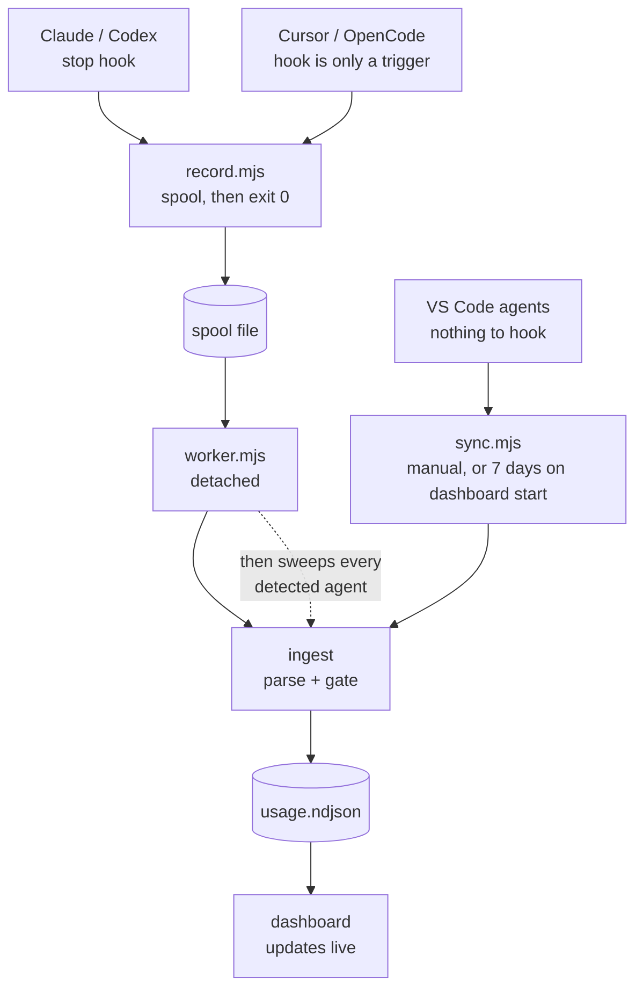
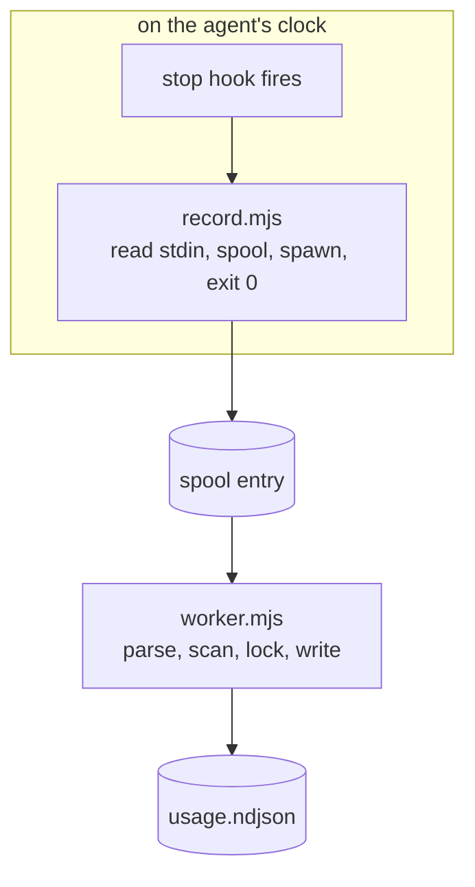

<div align="center">

# AI Usage Inspector

**Record every AI coding-agent prompt — tokens, model, context %, and cost — then explore it in one local dashboard.**


</div>

---

Your coding agent spends tokens on every prompt. This records what each one cost — priced from
published rates, or taken from the agent when it reports its own —
locally, in the project it happened in — and gives that project its own dashboard.

It tracks **Claude Code**, **OpenAI Codex**, **Cursor**, **OpenCode**, and the VS Code
agents **Cline**, **Roo Code**, and **Kilo Code**, and normalizes them into one record
shape so they sit side by side in the same table.



Two ways in, one way through. A live turn is captured the moment an agent stops. Anything
that fired no hook — a VS Code agent, or a CLI another agent launched — is picked up by the
sweep the same detached worker runs straight afterwards, or by `sync.mjs`, which the
dashboard also starts in the background over the last seven days. Everything meets at the
same ingest step.

## Features

- **Multi-agent, one table** — seven agents side by side, with provider filters, badges, charts, and cost/token splits.
- **Per-prompt detail** — prompt and response text, input/output/cache/reasoning tokens, model, permission mode, context fill %, USD cost, duration, first-response latency, skills, and tool/subagent counts where the agent exposes them.
- **Sessions as a tree** — each subagent run sits under the prompt that launched it, with its own tokens, cost, model and time, and runs it launched sit under it. A branched or forked Claude session sits under the session it came from, and a Codex agent thread or OpenCode subagent session under its parent. Every turn is counted once, and sessions show the name you gave them.
- **Stays out of your agent’s way** — the hook writes the payload to a spool file and exits; a detached worker does the parsing and writing. It reads stdin with a 150 ms idle cutoff and a two-second ceiling, so it returns even if the agent leaves the pipe open.
- **Yours, locally** — records live in your project, tracking can be turned off per project, and whole field groups (including the prompt text) can be stripped before anything is written. Turning a group off stops new recording; rows you already collected keep what they have.
- **Live dashboard** — the page follows the data as it is recorded, with full-text search, CSV/JSON export, and an optional monthly budget.
- **Zero dependencies, zero build** — pure Node built-ins and vanilla browser JS, covered by the built-in regression suite.

## Quick start

```sh
npx -y ai-usage-inspector
```

Or install it once and keep the command around:

```sh
npm install -g ai-usage-inspector
ai-usage-inspector
```

To run the unreleased tip instead, point npx at the repo:
`npx -y github:Kud0o/ai-usage-inspector`.

That looks for each agent’s own data directory, and registers a hook wherever one can run. Then just
use your agent — each project becomes self-contained, with its data, its own copy of the
viewer, and your saved view settings in `<project>/.ai-usage/`. To look:

Open **`.ai-usage/Open dashboard.cmd`** in the project (`Open dashboard.command` on macOS,
`open-dashboard.sh` on Linux). It starts the dashboard if it is not already running, waits until it
is actually up, and opens your browser at the right port. Click it again while that project's server
is still healthy and it reuses the process; simultaneous clicks are serialized so only one server
starts. There is no window to leave open — the server stops on its own a few minutes after you close
the last dashboard tab.

The launcher is written only after a successful non-aggregate store. Disabled projects, projects
with no stored turns, and aggregate-mode projects therefore do not get one. After upgrading, an
existing project gets it on its next successfully stored prompt. The launcher also needs `node` on
the GUI process's `PATH`; if it is missing, the shell reports that `node` was not found and the
dashboard does not open (the Windows launcher pauses so the message remains visible).

From a terminal, if you prefer:

```sh
cd <your project>
node .ai-usage/viewer/server.mjs   # -> http://localhost:4317
```

The records include your prompts, so `.ai-usage/` keeps itself out of git: it writes its own
`.gitignore`, and `git add -A` leaves it alone. Files a repository already tracks stay tracked;
`git rm -r --cached .ai-usage` stops that. To commit the records on purpose, change that
`.gitignore` — a file that is already there is never rewritten.

```sh
npx -y ai-usage-inspector --update      # upgrade
npx -y ai-usage-inspector --uninstall   # remove the hooks
```

## Supported agents

| Agent | Where the numbers come from | Registered in | Notes |
|---|---|---|---|
| Claude Code | `~/.claude/projects/.../*.jsonl` | `~/.claude/settings.json` | Exact usage, streamed-message dedupe, subagent runs as a tree, branches counted once, session names, skills |
| OpenAI Codex | `~/.codex/sessions/.../rollout-*.jsonl`, `~/.codex/archived_sessions/` | `~/.codex/hooks.json` | Cumulative token deltas per turn, agent threads nested under their parent, thread names |
| Cursor | `state.vscdb` SQLite stores | `~/.cursor/hooks.json` | Needs Node >= 22.5. Estimates tokens when Cursor stores no exact counts |
| OpenCode | `~/.local/share/opencode/opencode.db` | `~/.config/opencode/plugins/` | Needs Node >= 22.5. Tokens **and cost as OpenCode recorded them**; context from the largest single request against OpenCode's own model list; subagent sessions nested under their parent; a session whose per-message accounting is incomplete is stored as one rolled-up row |
| Cline · Roo · Kilo | `<VSCode>/User/globalStorage/<extId>/tasks/` | none — scan only | Tokens and cost as the extension recorded them. VS Code extensions cannot run a turn-end hook, so these arrive on sync or on the sweep any other agent triggers |

**Requirements:** Node >= 18, or >= 22.5 for Cursor and OpenCode (they are read from SQLite
via the built-in `node:sqlite`).

> **Antigravity** is detected and reported as unsupported: it encrypts its local
> conversations, so there is nothing on disk to read. **GitHub Copilot** is not supported
> either and is not detected — VS Code records the model it used but no token counts, so a
> row would carry a name and nothing to weigh it by.

## Installing

```sh
node install.mjs                  # every detected agent
node install.mjs --claude         # or one at a time: --codex --cursor --opencode
node install.mjs --cline          #                   --roo --kilo
node install.mjs --local          # Claude Code, this project only
node install.mjs --sync           # install, then import existing history
node install.mjs --dashboard      # one dashboard across every project
node install.mjs --uninstall      # remove the hooks
```

The installer copies the app to `~/.ai-usage-inspector/app/` and registers each agent's
hook in that agent's own config. Entries are marked, so uninstall removes only this tool's
hook and leaves your settings — including your own hooks — untouched.

After installing Codex tracking, open `/hooks` in Codex and trust the hook. Codex
deliberately skips new or changed command hooks until their definition is reviewed.

### Importing history you already have

A hook reparses the session it fires on, so its earlier turns arrive too, and the automatic sweep looks back a day on first run. To import everything the agents already have on disk:

```sh
node $HOME/.ai-usage-inspector/app/src/sync.mjs                      # everything
node $HOME/.ai-usage-inspector/app/src/sync.mjs --provider codex --days 30
node $HOME/.ai-usage-inspector/app/src/sync.mjs --reprice            # recompute stored costs
node $HOME/.ai-usage-inspector/app/src/sync.mjs --relabel            # refresh provenance where the amount is unchanged
```

Sync is idempotent — each transcript replaces what it stored before, so re-running never
duplicates — and it respects each project's tracking setting. Records you deleted in the
dashboard stay deleted: a tombstone is kept per record, and sync honours it.

An upgrade can ask for one full read. When a release changes how turns are identified or
costed, the installer marks each agent it finds for a single read of its whole history, so rows
stored the old way are rewritten; the next sweep, or the dashboard's start-up sync, does it. A
fresh install owes nothing, and imports no history you did not ask for.

Upgrading to 2.6.0 also removes what older versions stored twice: a session copied into a
subfolder's store when the agent had moved there, and turns a branch or fork copied from its
original, including branches in different projects. Cleanup removes only Claude rows, and only
when a fresh read under the changed file's lock verifies a surviving copy with at least as many
tokens. Cross-folder copies require that evidence in the session's home store; richer copies
are kept and reported. Branches keep the richest row, with the original winning ties, even when
the `branchOf` label follows a different ownership decision. Copied history does not choose a
branch's home folder unless all its turns are copied.

Manual sync and automatic sweeps share a scan lease. Cleanup locks every candidate usage file
and suppression file before changing any row; failure to acquire any lock aborts the cleanup.
Ownership and final tie-breaks are independent of discovery order. New Claude rows retain their
transcript's first-entry timestamp, and the earliest known source across a session's continuations
settles direction before the older timing heuristic. Missing or ambiguous evidence stays explicitly
unresolved; 2.5.0 rows retain the previous heuristic.

Branch-copy removal is durable: the losing store keeps a copy tombstone, so a later hook or sync
cannot recreate it. If the surviving store is later deleted, the suppressed copy will not return
on its own; restore the surviving store from backup, or deliberately remove the relevant copy
tombstone before re-importing. Keep tombstones when deleting an empty usage file.

Claude discovery also follows changes in subagent transcripts and metadata sidecars, even after
the parent stops changing. Both hooks and scans validate the complete input before writing;
unreadable dependencies fail for retry. Codex uses its recorded session folder before a hook's
fallback folder; different continuation files can still name different folders (see Known limits).

Candidate Claude stores are backed up **before the repair read**, and a failed backup leaves
the repair owed without ingesting anything. Cleanup also backs up the exact bytes it replaces
under the file's lock. Backups live in `~/.ai-usage-inspector/backups/`, with a recovery manifest
updated before each file changes. The outcome is written to
`~/.ai-usage-inspector/copy-cleanup.json`. If a store holds no rows, the report and `sync` name
its **`.ai-usage` folder** for optional deletion (or its aggregate file in `AI_USAGE_DIR` mode).
The project folder is never the deletion target.

## The dashboard

```sh
node .ai-usage/viewer/server.mjs                 # first free port from 4317
node .ai-usage/viewer/server.mjs --port 8080     # pinned: fails if taken, rather than moving
node .ai-usage/viewer/server.mjs --no-sync       # do not import the last 7 days on start
node .ai-usage/viewer/server.mjs --no-pricing-refresh   # do not fetch rates on start
```

- **Summary cards** — prompts, tokens, active time, first-response latency, top model, busiest workspace, this-month cost against an optional budget. With more than one agent in view, cost carries a per-agent split and a **by agent** breakdown appears.
- **Charts** — a calendar explorer with labelled axes, gridlines, independently scaled token-type charts and provider-stacked costs, mean/peak context-fill trends and distribution, and model, permission, skill and provider shares. Every calendar day is shown, including days with no use; switch to days with use only to collapse gaps. Day/week/month grouping is automatic or manual. Toggle series, compare a period with its visible-series average, open an on-demand text data table, and use the overview's single range selector — a labelled strip (daily tokens, cost or turns on a square-root scale) with two handles, a highlighted window to drag, and click-to-move — to explore. The shown range reads as plain dates with a day count, a Show all reset, and labelled Earlier/Later pan buttons; it changes charts only, and only **Filter to this range** applies the shown dates to since/until. Hover or tap for a readout; drag to zoom, **Ctrl/⌘ + scroll**, pinch or **+/−** to scale (a plain scroll over a chart scrolls the page), **←/→** to read, **Shift+←/→** to pan, and **Escape** or double-click to reset. Every time chart shares one zoom, so tokens, cost and context always show the same dates; zoom and legend changes leave stats and turn rows intact. Donut slices and keyboard-focusable legends highlight each other and retain share titles. Chart axis, grouping and legend preferences persist per viewer. Charts reflow on phones, respect reduced motion, and retain IBM Plex typography through Google Fonts.
- **Filter bar** — provider, platform, workspace, model, mode, effort, a since/until date range, minimum context %, and free-text search. Export the filtered view as CSV or JSON.
- **Table and detail drawer** — grouped by session, labelled with the session's name, then prompt, then subagent run and any run it launched. A branch nests under the session it came from, and a Codex agent thread or OpenCode subagent session under the turn that spawned it. A prompt's figures already include its runs; each run row shows its own share, and the drawer shows every run's tokens, cost and time beside the main thread's share, with rendered Markdown, usage, timing, cost, and metadata per turn.

- **Settings** — per project: tracking on/off, which field groups to store, monthly budget.
- **Delete** — remove the filtered records or a single prompt, with confirmation and the space the records freed. A small tombstone is kept for each, so a re-sync cannot resurrect it.

Session groups start open and can be closed again. Saved expansion preferences retain at most
500 distinct keys for sessions, turns and runs in the current view. Claude names and generated
titles belong to each session, even when one transcript contains several sessions.

Search matches the **whole stored prompt and response**, not the 280-character preview the
table shows, as well as session names and subagent run descriptions, and JSON export fetches the
full stored records — falling back to those previews, and saying so, if that fetch fails. The page subscribes to a change
feed and refreshes itself as the worker records new turns.

> The dashboard serves your prompt text and exposes a delete API, so it binds to
> `127.0.0.1`. Set `AI_USAGE_HOST` only if you deliberately want it reachable from your
> network.

## Where your data lives

Everything for a project stays inside that project:

```text
<project>/.ai-usage/
|-- usage.ndjson     one JSON record per prompt
|-- tombstones.json  records you deleted, so a later sync cannot bring them back
|-- config.json      tracking, stored fields, and saved view settings
|-- .gitignore       keeps all of this out of git
|-- Open dashboard.cmd   double-click to open the dashboard (.command / .sh elsewhere)
`-- viewer/          a copy of the dashboard; run it in place
```

A session's records stay in the project folder it started in, even when the agent moves into a
subfolder along the way or you resume the session from somewhere else.

Machine-wide state lives once, outside your projects, in `~/.ai-usage-inspector/`: the
installed `app/`, the hook `spool/` (normally empty), `scan-state.json`, and cached pricing
tables. While a launcher-started dashboard is open, its pid, port, absolute data path, and nonce
live in the OS temporary directory under a key derived from the canonical project path. That
machine-local coordination file goes away when the server stops and is never stored in the project.

The only thing written into an agent's own directory is its hook — listed in the table above,
and removed by `--uninstall`. Your prompts and costs never leave your machine: the hook and
sweep paths make no network calls at all. The one thing that does is fetching Anthropic's public
pricing and models pages — when the dashboard starts, which `--no-pricing-refresh` turns off, and
during `install` and `sync` at most twice a day. Set `AI_USAGE_NO_PRICING_REFRESH=1` to keep every
command off the network.

**Tracking is on by default and per project.** Turn it off, or strip whole field groups —
`text` (the prompt and response themselves), `tokens`, `cost`, `context`, `timing`,
`skills`, `counts`, `subagents` (the run tree), `meta` (session names among them) — from that
project's dashboard settings or its `config.json`. A disabled group is stripped *before* anything
is written, from the subagent runs too, including nested `counts`. Already stored values are
retained on a re-read while that group is disabled. See
[configuration in depth](docs/internals.md#configuration-in-depth).

**Combined dashboard:** point `AI_USAGE_DIR` at a shared folder, for both the hook and the
viewer, to pool every project into one dashboard.

## Why it does not slow your agent down

A stop hook runs on the agent's clock, so this one does almost nothing:



Only the boxed step is time the agent pays for. `record.mjs` imports no provider, opens no
database, and takes no lock — it writes the payload to the spool and returns. Measured on
Windows it comes back in 160-210 ms depending on the machine, and most of that is Node
starting up at all (~110-125 ms measured bare), so the tool itself costs roughly 50-80 ms.

The handover is built not to drop work: spool entries are claimed by atomic rename, and a
failed write is retried rather than dropped. A turn is given up only after three attempts
or seven days, and a payload over 1 MiB is truncated rather than held. See [the spool](docs/internals.md#the-spool) and
[the write](docs/internals.md#the-write).

### Work you delegate to another agent

Agents launched non-interactively by another agent — a delegate skill running `codex exec`, for
example — write their own transcript but fire no stop hook, so nothing tells this tool they ran.
Their cost is real and it belongs to the same project.

So after the worker has drained the spool, it also sweeps every installed provider for work that
arrived without a hook. That happens in the already-detached worker, off the agent's clock, and is
throttled so a burst of turns does not re-walk every store. The next turn from any agent pulls in
whatever the delegated one spent, without the delegate skill having to cooperate. How soon depends
on the next turn arriving: a provider is swept at most once a minute, and only if its agent was
detected at all.

Delegated turns land in the project the delegate itself reports as its working directory, so a run
launched against your repo is filed under your repo, not under wherever the launcher happened to be.

This covers the same agents the dashboard already scans, just sooner. If you would rather history
only arrive when you open the dashboard, set `"autoSweep": false` in
`~/.ai-usage-inspector/config.json`. A `--local` install never sweeps: it means this project only.

The dashboard then splits the numbers by agent, so delegated spend is visible rather than folded
into one total:

```text
cost  $695.50
      claude $655.14 · codex $40.36
```

The **by agent** card breaks that down further — prompts, tokens, active time, cost and share of
spend per agent. It appears whenever the view holds more than one agent.

## How much to trust a cost

Not every dollar figure is equally trustworthy, so each record says where its number came
from — and that decides what a re-sync may do with it:

| `cost.source` | Who worked the number out | On a re-sync |
|---|---|---|
| `provider` | the agent itself (OpenCode, Cline / Roo / Kilo) | **always taken fresh** — it is the authority on its own number |
| `priced` | this tool, from a rate table (Claude, Codex, Cursor with exact counts) | **kept as recorded** while the turn's tokens are unchanged |
| `estimated` | this tool, but something in the number was a guess — token counts derived from text length (Cursor with no local counts), or a model with no listed rate, charged at its family default | **kept as recorded** while the turn's tokens are unchanged |

A cost this tool worked out is a fact about the rates on the day the turn ran, so re-importing
history does not quietly restate it at today's rates — pass `--reprice` when you want that. The
same rule preserves computed costs of runs with unchanged usage, matched recursively by agent
ID, whenever the turn's computed cost is preserved. A recomputed turn keeps fresh run costs.
The viewer clamps the displayed main-thread share to zero if older data has larger run totals.
The promise covers rates, not tokens: when a re-read counts different tokens for a turn — an earlier
capture was incomplete, or an older version gave them to the wrong turn — its cost is worked out
again for the tokens really there. If a row is
labelled `estimated` and you now know the real rate, `--relabel` refreshes the provenance and
leaves the amount exactly as recorded. A turn
mixing exact and estimated parts counts as estimated overall, so a guess is never shown as
authoritative.

Rates and context windows ship built-in and refresh best-effort from Anthropic's docs — every
price column, cache reads included, and each current model's window — so a model released after
your version still prices and measures correctly. The hook path never touches the network; it
reads what the last refresh cached. When a version corrects rates it had wrong for a model, the
costs it stored for that model are worked out again once on upgrade; every other stored cost
stands. See [pricing refresh](docs/internals.md#pricing-refresh), and
[the numbers behind all this](docs/internals.md#the-numbers-behind-all-this) for the limits,
windows and retry bounds these paths run under.

## Caveats

- **Some rows are approximate, and say so.** A row is marked `≈ estimated` when Cursor's
  local stores held no exact token counts (it derives them from text length), or when the
  model has no listed price and is charged at its family default rate. Built-in rates cover
  current models; the dashboard refreshes them, so a brand-new model is usually only
  estimated until that first refresh. OpenCode and the VS Code agents report exact tokens
  and cost themselves, so their rows are never estimated.
- **Auto-continued turns are not prompts.** When a session runs out of context it is compacted, and
  the continuation is written as if the user had typed it. Those turns are marked `⟳` and counted
  separately from prompts — the work they did is real and its cost is included, but nobody asked for
  it in those words.
- **`effort` is Claude-specific**, and read from settings when a hook captures the turn; a later
  sync keeps what the hook recorded. Other agents leave it blank unless they expose it.
- **Codex agent threads keep the history they inherit.** Codex copies part of a parent thread into
  each child it spawns, and those turns are still counted as the child's. The dashboard nests the
  child under its parent, but its numbers are as recorded until that copying can be told apart.
- **`context fill %`** is the input size of a thread's latest request over its model's context
  window (for OpenCode, the largest request in the turn). The main thread and each subagent run are
  separate conversations, so a turn shows its main thread's fill and every run shows its own. A
  Claude model with no known window is measured against a default, and a request larger than that
  default is measured against 1M instead — so a context is never reported more than full. For
  OpenCode and the VS Code agents an unknown window is left unknown and shown as `—`, and such rows
  stay out of the context charts and averages rather than counting as 0%.
- **First-response latency** is transcript-granularity timing, not a model-side metric.
- **Disabling a field group affects new records only.** It does not scrub what is already
  written — use the delete controls for that.

More, including the rougher edges: [Internals](docs/internals.md).

## License

[MIT](LICENSE)

The npm package includes the installer, runtime source, viewer, README, and documentation.
Regression tests and test-support utilities remain in the repository.
