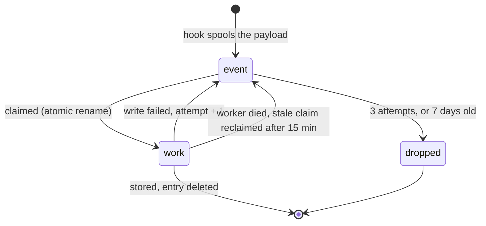
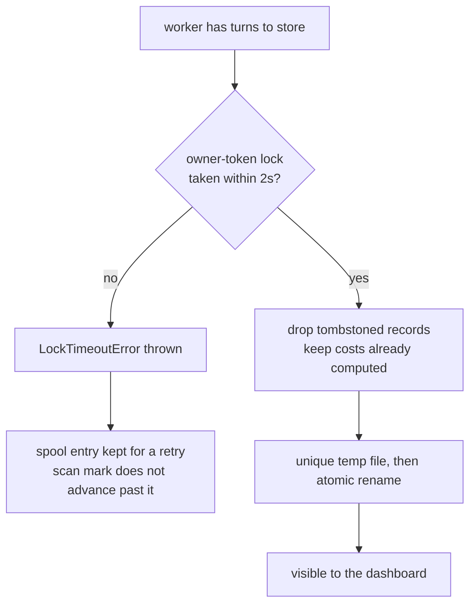

# Internals

How AI Usage Inspector is built, for anyone changing it or auditing what it does on
their machine. Start with the [README](../README.md) if you just want to use it.

- [Provider model](#provider-model)
- [The spool](#the-spool)
- [The write](#the-write)
- [Scan windows](#scan-windows)
- [What each provider reads](#what-each-provider-reads)
- [Configuration in depth](#configuration-in-depth)
- [Pricing refresh](#pricing-refresh)
- [Dashboard API](#dashboard-api)
- [Project layout](#project-layout)

## Provider model

Every supported agent has a provider module under `src/providers/<id>/`. A provider owns
the hook payload shape, transcript/history discovery, the parser, its pricing table, the
dynamic pricing refresh, and install/uninstall wiring. The shared core owns config, field
stripping, atomic NDJSON upserts, viewer bundling, and the dashboard API.

Every provider emits the same turn-record shape, so the viewer mixes all of them in one
table without provider-specific UI branches. Adding an agent means one folder plus one line
in `src/providers/index.mjs` — there are two templates to copy: hook-plus-transcript
(Claude, Codex) and scan-based (Cursor, OpenCode, the VS Code agents).

Backfill is deliberately synchronous, since it is a CLI you are waiting on:

```text
src/sync.mjs -> provider.discoverTranscripts() -> ingestTranscript() -> .ai-usage/usage.ndjson
```

## The spool

A spooled event is not a fire-and-forget gamble. Each entry changes state by atomic
rename, so exactly one worker can ever claim it, and anything left behind by a crashed
worker is picked up later:



Verified by running four workers against eight events at once: exactly eight processed,
none twice and none lost.

## The write

Several agent sessions can write to one project at once, so every write takes a lock and
lands atomically.



The `no` branch matters more than it looks. A write that *could not happen* used to report
the same `0` as a write that legitimately had nothing to do, so a busy lock looked like
success and the work was silently dropped. It now throws, which is what makes the retry
possible.

A lock is only stolen once genuinely stale, and only ever removed by its owner. Lines that
are not valid JSON are carried through a rewrite rather than discarded. Twelve processes
writing one file at once lose nothing.

## Scan windows

Scan-based providers (Cursor, OpenCode) do not rescan a fixed window. Each keeps a durable
high-water mark in `~/.ai-usage-inspector/scan-state.json` and resumes from it with a five
minute overlap, so an outage longer than a day does not quietly drop history.

The mark only advances when a scan both found a healthy store and stored everything it
found. A locked database, a schema the reader does not recognise, or a single failed write
leaves it where it was — and the scan status (`ok`, `locked`, `unsupported-schema`,
`missing`) is recorded, so stale capture is visible rather than looking like an idle day.

## Sweeping for hookless work

Not every run announces itself. An agent launched non-interactively by another agent — a delegate
skill shelling out to `codex exec`, say — writes its transcript but fires no stop hook.

After [drainSpool()](../src/worker.mjs) empties the spool, the worker calls `sweepProviders()`,
which walks every installed provider that implements `discoverTranscripts` and ingests anything
newer than that provider scan mark. It runs only once the spool is empty, so no envelope is held
claimed while it works, and it skips any provider scanned within the last minute so a burst of turns
does not re-walk every store. It never touches the network and never refreshes pricing.

The cost is small because the watermark bounds it: a sweep across four installed providers with
nothing new to import takes about 140 ms, entirely inside the detached worker.

A provider that throws is skipped, leaving its watermark where it was, so the next sweep retries it.

Several workers can finish at the same moment, so the throttle is a claim rather than a check:
`claimScan()` tests the mark and stamps it inside one locked mutation, and only the caller that
wins may scan. Losing callers stand down instead of scanning the same store in parallel.

The sweep covers every detected agent — the same set `sync.mjs` and the dashboard already scan, so
it widens no scope. What it changes is timing: history arrives after a turn rather than only when
someone opens the dashboard. Set `"autoSweep": false` in `~/.ai-usage-inspector/config.json` to go
back to importing on demand.

A `--local` install means "this project only", so its worker does not sweep at all — the project
still records its own turns through the hook. The sweep also waits for the spool to go quiet:
another worker holding a claimed envelope is still writing the very sessions a scan would parse,
and parsing happens before the write lock is taken.

Pricing caches carry a schema version. A file written before the cache recorded *which* rates were
guessed cannot be interpreted after the fact — a published rate that happens to be a tenth of the
input rate is indistinguishable from the synthesis this tool applies when a provider publishes none
— so such a file is treated as absent. The built-in table prices until the next refresh writes a
cache that records what it knows.

Parsing happens outside the usage lock, so a scan that started before the agent appended its newest
turn could take the lock afterwards and replace the session with its older snapshot.
`ingestTranscript()` therefore stamps the transcript before parsing and again before writing, and
abandons the pass if it moved. The scan mark does not advance, so the next sweep re-reads it whole. The
same stamp is checked once more inside the write lock, since the config read and the queue for the
lock are themselves time in which the agent can append — under the lock is the only place the
question can be answered without a window. Only Claude and Codex hand over a file path;
Cursor, OpenCode and the Cline family pass an opaque reference into their own store and supply their
own `stampTranscript()`, so the guard is not silently inert for them.

A scan claim carries an owner token. Without one, any result could release whichever lease happened
to be held — including a scan that overran its own lease and returned after another worker took it.

A sweep prefers a quiet spool, but a continuously busy machine never offers one — so once nothing
has scanned for fifteen minutes it sweeps regardless. Overlapping a writer is survivable now that a
moved transcript abandons its pass and `claimScan()` keeps two sweeps off one provider.

Automatic provenance correction is one-way, which can leave a row `estimated` after the real rate
becomes known. `sync --relabel` is the escape hatch: it accepts new provenance whenever the amount is
unchanged, in either direction, and still refuses a different amount — that is what `--reprice` is for.

## What each provider reads

**Claude Code** — three transcript realities make the numbers trustworthy
([`src/providers/claude/transcript.mjs`](../src/providers/claude/transcript.mjs)):

| Reality of the transcript | Handling |
|---|---|
| One assistant message spans many streamed lines sharing `message.id` | Dedupe by id; keep the final usage |
| Subagents live in separate `.../<session>/subagents/*.jsonl` files | Attribute to the parent prompt via `promptId` |
| Subagents may run a cheaper model | Price each message at its own model |

`counts.subagentCalls` is the number of subagent *files* (one per Task invocation), not a
flattened count of their assistant messages.

**OpenAI Codex** — rollout files carry cumulative token totals.
[`src/providers/codex/transcript.mjs`](../src/providers/codex/transcript.mjs) segments the
rollout at each user message and stores the **delta** of the running total across the turn,
which handles tool loops and multiple model calls inside one response.

**Cursor** — the stop hook is only a trigger.
[`src/providers/cursor/`](../src/providers/cursor/) scans Cursor's local SQLite stores
(`state.vscdb`), maps composer conversations back to workspaces via `workspace.json`, and
orders bubbles by `fullConversationHeadersOnly` rather than insertion order. When Cursor
has no per-message token counts it estimates from text length (~4 chars/token) and marks
the cost `estimated`. Every table also carries a fallback tier for models it has never
heard of; a cost derived from that tier is labelled `estimated` too, so a guessed rate is
never presented as a looked-up one.

**OpenCode** — a `session.idle` plugin is the trigger.
[`src/providers/opencode/`](../src/providers/opencode/) scans `opencode.db`, segments each
session's messages into per-prompt turns, and reads exact tokens and cost straight from the
database. If per-message accounting is incomplete it falls back to OpenCode's authoritative
per-session rollup rather than inventing zeros for the missing turns.

**Cline / Roo Code / Kilo Code** — one lineage sharing one on-disk format, so
[`src/providers/clinefamily/`](../src/providers/clinefamily/) covers all three. Tokens and
cost come from each task's `api_req_started` entries in `ui_messages.json`; the model and
workspace come from the conversation history. One user prompt drives an agentic loop of
many model calls, so usage and cost are summed across the turn while **context fill uses
the largest single call**, not the sum.

The generic SQLite plumbing (busy retry, schema check, scan status) is shared in
[`src/lib/sqlite.mjs`](../src/lib/sqlite.mjs); the VS Code `globalStorage` locator, which
also covers forks like Cursor, Windsurf and VSCodium, is in
[`src/lib/vscode.mjs`](../src/lib/vscode.mjs).

## Configuration in depth

A field group turned off is applied on the way in, so new rows omit it. Rows already written keep
what they have: a reparse of the same session restores the stored value rather than rewriting the
row without it, because "stop recording this" is not "delete what you recorded".

In aggregate mode there is no per-project folder, so the dashboard writes one `config.json` beside
the pooled data and capture reads it — tracking and field switches there govern every project in the
pool, falling back to the global defaults for anything they do not set.


A **global defaults template** lives at `~/.ai-usage-inspector/config.json`
(`{ "enabledDefault": true, "fields": { ... } }`). It is *only* a template:

- **Global install** — each project **inherits a copy** of the defaults into its own
  `config.json` the first time it is seen, then is independent. Tracking is on by default;
  disable or tune a project from *its own* dashboard without affecting others.
- **Local install** (`node install.mjs --local`) — the project's `config.json` is written at
  install time, fully self-contained, with no reliance on the global file.
- **Aggregate mode** (`AI_USAGE_DIR`) is the one exception: with everything pooled in one
  folder there is no per-project file, so the global defaults govern directly.

**Field groups** are `text` (prompt/response), `tokens`, `cost`, `context`, `timing`
(duration + first-response latency), `skills`, `counts`, and `meta` (git branch, cli
version, slug, tier, effort). A disabled group is **stripped before writing**; already
stored data is left as-is, and `text` off keeps the character counts but drops the text.

The viewer adapts: cards, charts, table columns, drawer rows and filters for a disabled or
absent field group do not render.

## Pricing refresh

Per-model rates ship built-in, and when a project tracks cost each viewer start refreshes
them:

| Provider | Source | Cache |
|---|---|---|
| Claude | Anthropic's public [pricing page](https://platform.claude.com/docs/en/about-claude/pricing) | `~/.ai-usage-inspector/pricing-claude.json` |
| OpenAI | [models.dev](https://models.dev) (OpenAI publishes no machine-readable pricing) | `~/.ai-usage-inspector/pricing-codex.json` |
| Cursor | Cursor's [models & pricing](https://cursor.com/docs/models-and-pricing) docs | `~/.ai-usage-inspector/pricing-cursor.json` |
| OpenCode | none needed — it stores its own cost per message | — |

There is no pricing API or version to check, so it re-fetches every run and
**content-diffs** the result: a cache and its startup log line only move when a rate
actually changed, and it prints exactly which models moved. Offline, or when cost is not
tracked, the built-in tables are used and no fetch happens.

Costs are computed and stored **when each prompt is recorded**, so refreshed rates apply to
turns recorded after the cache last updated. The hook path reads the cache locally and
never makes a network call. New models are picked up automatically; their context window
falls back to a default until the built-in table is updated.

## Dashboard API

The viewer is a small HTTP service, so the data is scriptable without the UI:

| Route | Purpose |
|---|---|
| `GET /api/events` | every record as list items (280-char previews, no full text) |
| `GET /api/search?q=` | full-text match over the stored prompt/response; returns matching record keys |
| `POST /api/export` | `{keys:[...]}` -> the complete records, prompt and response included |
| `GET /api/event/:id` | one full record |
| `GET /api/stream` | server-sent events; emits `change` when the data dir is written |
| `GET/POST /api/config` | the project's tracking, field, and UI settings |
| `DELETE /api/events` | `{keys:[...]}` -> tombstone + remove |

## Project layout

```text
src/record.mjs             hook launcher: read stdin, spool, spawn worker, exit 0
src/worker.mjs             detached spool consumer: parse, scan, write, retry
src/sync.mjs               backfill/sync existing provider history
src/lib/ingest.mjs         provider-neutral flow: normalize -> buildTurns -> upsert -> bundle
src/lib/store.mjs          owner-token locks, atomic upsert, tombstones, cost preservation
src/lib/scan-state.mjs     per-provider scan high-water marks + scan health
src/lib/config.mjs         tracking/field config (copied into each project bundle)
src/lib/paths.mjs          data dir / cwd-encoding helpers
src/lib/pricing-core.mjs   shared cost object + math, incl. cost provenance
src/lib/sqlite.mjs         node:sqlite helpers: busy retry, schema check, scan status
src/lib/vscode.mjs         VS Code globalStorage locator, across forks
src/providers/index.mjs    provider registry + install detection
src/providers/<id>/        one folder per agent
viewer/server.mjs          zero-dep HTTP API + static host
viewer/public/             the dashboard SPA
install.mjs                installer + uninstaller
test/                      88 tests: every provider, the store, the spool, the API, the installer
```

```sh
npm test      # Node's built-in runner, no dependencies
```

## Known limits

- **`encCwd` collisions.** In aggregate mode a project's filename is its path with
  separators flattened to `-`, so `/a-b/c` and `/a/b-c` collide. Rare, and pinned by a test
  so any fix has to be deliberate.
- **Claude `effortLevel`** is read from `settings.json` at capture time, so a rebuilt turn
  gets today's setting rather than the one it ran under. Sync passes none at all.
- **A computed cost is preserved on the hook path too.** If a turn were ever captured
  before it finished, its cost would stay as first recorded until `sync --reprice`.
- **Cursor multi-root workspaces** are not resolved; only `workspace.json`'s single
  `folder` is read.
