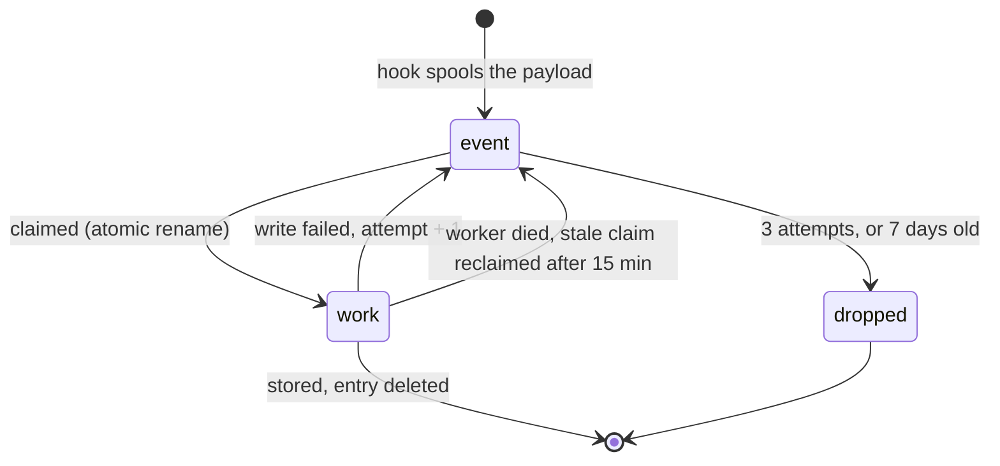
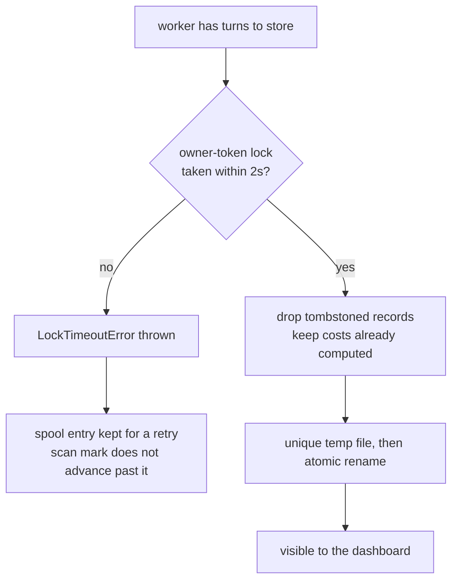

# Internals

How AI Usage Inspector is built, for anyone changing it or auditing what it does on
their machine. Start with the [README](../README.md) if you just want to use it.

- [Provider model](#provider-model)
- [The spool](#the-spool)
- [The write](#the-write)
- [Scan windows](#scan-windows)
- [What each provider reads](#what-each-provider-reads)
- [Configuration in depth](#configuration-in-depth)
- [Pricing refresh](#pricing-refresh)
- [Dashboard API](#dashboard-api)
- [Project layout](#project-layout)

## Provider model

Every supported agent has a provider module under `src/providers/<id>/`. A provider owns
the hook payload shape, transcript/history discovery, the parser, its pricing table, the
dynamic pricing refresh, and install/uninstall wiring. The shared core owns config, field
stripping, atomic NDJSON upserts, viewer bundling, and the dashboard API.

Every provider emits the same turn-record shape, so the viewer mixes all of them in one
table without provider-specific UI branches. Adding an agent means one folder plus one line
in `src/providers/index.mjs` — there are two templates to copy: hook-plus-transcript
(Claude, Codex) and scan-based (Cursor, OpenCode, the VS Code agents).

Backfill is deliberately synchronous, since it is a CLI you are waiting on:

```text
src/sync.mjs -> provider.discoverTranscripts() -> ingestTranscript() -> .ai-usage/usage.ndjson
```

## The spool

A spooled event is not a fire-and-forget gamble. Each entry changes state by atomic
rename, so only one worker can claim a given entry, and anything left behind by a crashed
worker is picked up later:



Verified by running four workers against eight events at once: exactly eight processed,
none twice and none lost.

## The write

Several agent sessions can write to one project at once, so every write takes a lock and
lands atomically.



The `no` branch matters more than it looks. A write that *could not happen* used to report
the same `0` as a write that legitimately had nothing to do, so a busy lock looked like
success and the work was silently dropped. It now throws, which is what makes the retry
possible.

A lock is stolen only once older than the staleness window — age is the only evidence available
that its owner died — and is only ever removed by its owner. Lines that
are not valid JSON are carried through a rewrite rather than discarded. Twelve processes
writing one file at once lose nothing.

What a write replaces is one transcript's contribution to one session. A provider that keeps a
session in a single source — Cursor, OpenCode, the Cline family — names no transcript, and its
batch replaces the whole session, so a turn that has left the source goes too. Claude and Codex
name the file: Codex continues a reverted thread in a new rollout under the same thread id, and
reading one file must not delete the other's turns. Rows written before rows named their
transcript are replaced wholesale by the session's own transcript, because they can carry ids and
timestamps today's parser no longer produces; any other transcript takes only the turns it can
name. When two sources carry the same turn, the copy holding the work is the one kept. An old,
position-based id identifies which stored row a continuation replaces, but blocks nothing and passes
on nothing — it may have been another turn's — so a continuation turn deleted before its id was
qualified can reappear once; deleting it again sticks.

A session's rows belong to the folder it started in: the first folder its own turns name that still
exists. Turns marked `copied: true` are ignored unless every turn in the session is copied.
A hook reports wherever the agent is when a turn ends, and Claude Code moves a desktop
session into any project subfolder its own commands `cd` into, so storing under the hook's folder
copied whole sessions into subfolders beside the original. The sweep already used the first turn's
folder, so the hook and the sweep now agree. The hook's folder is used only when no folder a turn
names still exists, so a project that moved keeps recording.

`/branch` and `--fork-session` copy earlier turns into a new Claude session and keep each message's
uuid, so a branch's transcript holds turns its original already stored. The holder with the most
tokens keeps the turn, with the original winning ties; branch labels still follow the session
arbitration. Each new Claude row persists `transcriptFirstTs`, the first timestamped entry in
its source transcript. `firstEntryDirection` uses the earliest known source stamp across each
session's rows, including already stored continuation files; a later file's opening is not treated
as the session's birth. Both sides need evidence, the stamps must differ, and the earlier source
must reach back to the shared turn. This settles direction even inside the old 60-second window.
`branchResolution` is `resolved` only with that evidence, otherwise `unresolved`.

Without that evidence (including 2.5.0 rows), the previous rules remain: a prompt more than a
minute older than the source's first entry is marked `copied`; a mark on only one side settles
it. Where the marks agree and only one side has been read by this version, that side keeps the
turn: rows an older version wrote name no first entry, and a batch skipped on timing alone is
never written, so a later pass of the same repair could not put it back. Otherwise compare own
turns before the shared history, then continuation timing, with a session holding only shared
turns preferred. Normal ingestion retains the stored holder on a
heuristic tie. Cleanup sorts session IDs before arbitration, uses a lexical final tie-break for
ownership and equally recent parent labels, and breaks home-folder timestamp ties by normalized
path, so discovery order cannot reverse removal decisions. An incoming copy is skipped only if
a stored holder has at
least as many tokens; an original takes a turn back only if its incoming row has at least as many.
Otherwise the richer stored row stays and the incoming row is dropped, while `branchOf` still
follows arbitration. Token totals use the sum of numeric usage fields, including subagent work.
A turn deleted under the original does not come back through a branch. Only a message uuid can be a
copy: other ids are built from the session and cannot collide, and other providers are left alone.

## Scan windows

Scan-based providers (Cursor, OpenCode) do not rescan a fixed window. Each keeps a durable
high-water mark in `~/.ai-usage-inspector/scan-state.json` and resumes from it with a five
minute overlap, so an outage longer than a day does not quietly drop history.

The mark only advances when a scan both found a healthy store and stored everything it
found. A locked database, a schema the reader does not recognise, or a single failed write
leaves it where it was — and the scan status (`ok`, `locked`, `unsupported-schema`,
`missing`) is recorded, so stale capture is visible rather than looking like an idle day.

An upgrade across a change in how turns are identified or costed also records a repair for each
agent the installer finds. Until that agent's history has been read in full once, its window
starts at the beginning. Only a pass that reached every transcript it listed settles the repair —
save transcripts that moved while being read, which belong to a live session its hook reads
again. `sync.mjs` honours the same repair, so machines that never sweep (`--local`,
`autoSweep: false`) settle it the first time the dashboard starts. A repair is settled per
destination: a pass into an aggregate `AI_USAGE_DIR` does not count for the rows each project holds.

Before either `worker.rescan` or `sync` ingests an owed Claude repair, it discovers candidate stores
and backs up those containing Claude rows under their file locks. A failed backup ingests nothing
and leaves the repair owed. This preserves the rows that the repair read itself can replace.

After ingestion, cleanup removes what older versions stored twice
([`src/lib/copies.mjs`](../src/lib/copies.mjs)). Only Claude rows are eligible. Cross-folder removal
requires the same key in the session's home store with at least as many tokens; a richer copy is
kept and counted in `keptRicher`. Branch collapse is planned over all candidate stores together,
using `planCollapseCopies`, and retains the richest holder, with the original winning ties.
`collapseCopies` retains its existing `{ records, removed }` API.

Cleanup acquires every candidate usage and tombstone lock in sorted order before the first
mutation. A timeout aborts without removing any rows. Explicit sync takes the same provider
scan lease as the worker and releases only its own lease in `finally`; a refused lease skips
discovery, repair, and cleanup. The deterministic arbitration is an independent defence.

Before dropping a branch row, cleanup backs it up and records a durable tombstone with
`reason: "copy"`. It blocks only that provider/session/turn key. Unlike user-deletion tombstones,
it does not suppress the UUID in other sessions. Aggregate stores share one tombstone file;
project stores keep their own. We chose suppression over cross-store lookups on every ingest:
a temporary missing or inaccessible owner must not silently recreate double counting. The cost
is deliberate recovery if the surviving store is later deleted: restore its backup, or remove
the losing key's copy tombstone and re-import. Keep the suppression file when removing empty
usage files. Backups include pre-existing tombstone bytes before they change.

Each file's mutation re-reads the potential holders under that file's lock. Snapshot evidence
cannot authorize a deletion: a row may go only while a freshly read survivor holds at least as
much work for the same turn. If evidence is missing, both rows stay. `mutateNdjson`'s
`onBeforeWrite(currentText)` hook backs up the exact replacement bytes while still holding the lock.
Backups live in `~/.ai-usage-inspector/backups/<timestamp>-<unique-id>/`; `manifest.json` is updated
atomically after every backup and before changing its source, so interruption leaves every changed
file identified. Pre-ingestion and cleanup snapshots share the repair's backup directory.

The outcome is written to `~/.ai-usage-inspector/copy-cleanup.json`. `emptyStores` and sync's
guidance name only an emptied **`.ai-usage` directory**, or the aggregate file in `AI_USAGE_DIR`
mode. The store holds no rows and that usage directory or aggregate file can be deleted; the
project directory is never offered for deletion. Cleanup deletes no directories. A failed cleanup
leaves the repair owed.

## Sweeping for hookless work

Not every run announces itself. An agent launched non-interactively by another agent — a delegate
skill shelling out to `codex exec`, say — writes its transcript but fires no stop hook.

After [drainSpool()](../src/worker.mjs) empties the spool, the worker calls `sweepProviders()`,
which walks every installed provider that implements `discoverTranscripts` and ingests anything
newer than that provider scan mark. It runs only once the spool is empty, so no envelope is held
claimed while it works, and it skips any provider scanned within the last minute so a burst of turns
does not re-walk every store. It never touches the network and never refreshes pricing.

The cost is small because the watermark bounds it: a sweep across four installed providers with
nothing new to import takes about 140 ms, entirely inside the detached worker.

A provider that throws is skipped, leaving its watermark where it was, so the next sweep retries it.

Several workers can finish at the same moment, so the throttle is a claim rather than a check:
`claimScan()` tests the mark and stamps it inside one locked mutation, and only the caller that
wins may scan. Losing callers stand down instead of scanning the same store in parallel.

The sweep covers every detected agent — the same set `sync.mjs` and the dashboard already scan, so
it widens no scope. What it changes is timing: history arrives after a turn rather than only when
someone opens the dashboard. Set `"autoSweep": false` in `~/.ai-usage-inspector/config.json` to go
back to importing on demand.

A `--local` install means "this project only", so its worker does not sweep at all — the project
still records its own turns through the hook. The sweep also waits for the spool to go quiet:
another worker holding a claimed envelope is still writing the very sessions a scan would parse,
and parsing happens before the write lock is taken.

Pricing caches carry a schema version. A file written before the cache recorded *which* rates were
guessed cannot be interpreted after the fact — a published rate that happens to be a tenth of the
input rate is indistinguishable from the synthesis this tool applies when a provider publishes none
— so such a file is treated as absent. The built-in table prices until the next refresh writes a
cache that records what it knows.

Parsing happens outside the usage lock, so a scan that started before the agent appended its newest
turn could take the lock afterwards and replace the session with its older snapshot.
`ingestTranscript()` therefore stamps the transcript before parsing and again before writing, and
abandons the pass if it moved. The scan mark does not advance, so the next sweep re-reads it whole. The
same stamp is checked once more inside the write lock, since the config read and the queue for the
lock are themselves time in which the agent can append — under the lock is the only place the
question can be answered without a window. Only Claude and Codex hand over a file path;
Cursor, OpenCode and the Cline family pass an opaque reference into their own store and supply their
own `stampTranscript()`, so the guard is not silently inert for them.

Claude now supplies `stampTranscript()` too. Its snapshot covers the parent, the sorted subagent
file membership, each `.jsonl`, and each `.meta.json` sidecar, by size and mtime.
Discovery compares the newest dependency or directory mtime, so background completion, sidecar
updates, and removals can rediscover an unchanged parent. A dependency that cannot even be
stat-ed is returned for ingest to fail and retry. One that stats but cannot be read fails where
it is read — the parse throws, the scan reports failure, and its watermark stays behind it — so a
partial parse is never certified either way. Hook ingestion uses the same guarded path. The
snapshot deliberately does not hash file contents: a sweep stamps every transcript on the machine,
and reading hundreds of megabytes of history to learn that nothing changed costs more than the
scan it guards.

A scan claim carries an owner token. Without one, any result could release whichever lease happened
to be held — including a scan that overran its own lease and returned after another worker took it.

A sweep prefers a quiet spool, but a continuously busy machine never offers one — so once nothing
has scanned for fifteen minutes it sweeps regardless. Overlapping a writer is survivable now that a
moved transcript abandons its pass and `claimScan()` keeps two sweeps off one provider.

Automatic provenance correction is one-way, which can leave a row `estimated` after the real rate
becomes known. `sync --relabel` is the escape hatch: it accepts new provenance whenever the amount is
unchanged, in either direction, and still refuses a different amount — that is what `--reprice` is for.

## What each provider reads

**Claude Code** — three transcript realities make the numbers trustworthy
([`src/providers/claude/transcript.mjs`](../src/providers/claude/transcript.mjs)):

| Reality of the transcript | Handling |
|---|---|
| One assistant message spans many streamed lines sharing `message.id` | Dedupe by id; keep the final usage |
| Each subagent run is its own `.../<session>/subagents/agent-<id>.jsonl`, beside `agent-<id>.meta.json` naming the tool call that launched it | The run belongs to the turn — or the run — whose message made that call, and is kept there as a tree with its own tokens, cost, model and time |
| Runs written before sidecars existed carry only their prompt's `promptId`, and a slash command writes its command line, output and expanded prompt as entries of one prompt | Such a run goes to the last turn of its prompt that did any work, never to each of them |
| Subagents may run a cheaper model | Price each message at its own model |
| After `/compact`, earlier prompts are written again under the same uuid | A replayed uuid opens no turn, so the real turn keeps its tokens |
| The session's name is a `custom-title` line written again as the session goes on; an unnamed session gets `ai-title` lines | The last of each per entry `sessionId` (falling back to the file's session) becomes that session's `sessionName` and `sessionTitle` |

A turn's `usage` and `cost` include every run beneath it, counted once, while each run in its
`subagents` array carries its own share, its children excluded. `counts.subagentCalls` is the number
of runs in the tree, not a flattened count of their assistant messages.

**OpenAI Codex** — rollout files carry cumulative token totals.
[`src/providers/codex/transcript.mjs`](../src/providers/codex/transcript.mjs) segments the
rollout at each user message and stores the **delta** of the running total across the turn,
which handles tool loops and multiple model calls inside one response.

A reverted thread continues in a new rollout under the same thread id,
`rollout-<ts>-<thread>_<rollout>.jsonl`, and the rollout id tells the store which file wrote
which rows. Its turns count from zero again, so in that file an id built from a position — the
fallback, or Codex's own `rollout-N` — is qualified with the rollout id and keeps the old one as
`legacyId`. Codex's UUID turn ids are unique on their own and never change. Rollouts Codex has
moved to `archived_sessions` are read as well.

An agent Codex spawns, and a guardian thread, is its own thread with its own rollout, whose
`session_meta` names its `parent_thread_id`. Every turn of such a thread carries `parentSessionId`
and `agent` (`kind` spawned or guardian, nickname, path, role, depth). In the parent's rollout the
`spawn_agent` call completes with an `item_completed` record whose `SubAgentActivity` item names the
child in `agent_thread_id`; the turn it completed in carries `spawnedAgents`, which is how the
dashboard nests the child under the turn that launched it. The child's numbers are left exactly as
recorded. A thread's name comes from Codex's `session_index.jsonl`, the latest entry for it winning.
OpenCode's session title and Cursor's composer name become `sessionName` the same way.

**Cursor** — the stop hook is only a trigger.
[`src/providers/cursor/`](../src/providers/cursor/) scans Cursor's local SQLite stores
(`state.vscdb`), maps composer conversations back to workspaces via `workspace.json`, and
orders bubbles by `fullConversationHeadersOnly` rather than insertion order. When Cursor
has no per-message token counts it estimates from text length (~4 chars/token) and marks
the cost `estimated`. Every table also carries a fallback tier for models it has never
heard of; a cost derived from that tier is labelled `estimated` too, so a guessed rate is
never presented as a looked-up one.

**OpenCode** — a `session.idle` plugin is the trigger.
[`src/providers/opencode/`](../src/providers/opencode/) scans `opencode.db`, segments each
session's messages into per-prompt turns, and reads exact tokens and cost straight from the
database. If per-message accounting is incomplete it falls back to OpenCode's authoritative
per-session rollup rather than inventing zeros for the missing turns.

**Cline / Roo Code / Kilo Code** — one lineage sharing one on-disk format, so
[`src/providers/clinefamily/`](../src/providers/clinefamily/) covers all three. Tokens and
cost come from each task's `api_req_started` entries in `ui_messages.json`; the model and
workspace come from the conversation history. One user prompt drives an agentic loop of
many model calls, so usage and cost are summed across the turn while **context fill uses
the largest single call**, not the sum.

The generic SQLite plumbing (busy retry, schema check, scan status) is shared in
[`src/lib/sqlite.mjs`](../src/lib/sqlite.mjs); the VS Code `globalStorage` locator, which
also covers forks like Cursor, Windsurf and VSCodium, is in
[`src/lib/vscode.mjs`](../src/lib/vscode.mjs).

## Configuration in depth

A field group turned off is applied on the way in, so new rows omit it. Rows already written keep
what they have: a reparse of the same session restores the stored value rather than rewriting the
row without it, because "stop recording this" is not "delete what you recorded".

In aggregate mode there is no per-project folder, so the dashboard writes one `config.json` beside
the pooled data and capture reads it — tracking and field switches there govern every project in the
pool, falling back to the global defaults for anything they do not set.


A **global defaults template** lives at `~/.ai-usage-inspector/config.json`
(`{ "enabledDefault": true, "fields": { ... } }`). It is *only* a template:

- **Global install** — each project **inherits a copy** of the defaults into its own
  `config.json` the first time it is seen, then is independent. Tracking is on by default;
  disable or tune a project from *its own* dashboard without affecting others.
- **Local install** (`node install.mjs --local`) — the project's `config.json` is written at
  install time, fully self-contained, with no reliance on the global file.
- **Aggregate mode** (`AI_USAGE_DIR`) is the one exception: the aggregate directory's own
  `config.json` governs the pool, with global defaults filling only fields it does not set.

**Field groups** are `text` (prompt/response), `tokens`, `cost`, `context`, `timing`
(duration + first-response latency), `skills`, `counts`, `subagents` (the run tree), and
`meta` (git branch, cli version, slug, tier, effort, session names). A disabled group is
**stripped before writing**; already stored data is left as-is, and `text` off keeps the
character counts but drops the text.
Turning `text`, `tokens`, `cost`, `timing` or `counts` off also strips each run's description,
usage, cost, duration or counts, respectively, recursively. On re-read, existing disabled fields
are restored by `agentId`, as they are for the turn itself.

The viewer adapts: cards, charts, table columns, drawer rows and filters for a disabled or
absent field group do not render.

## Pricing refresh

Per-model rates ship built-in, and when a project tracks cost each viewer start refreshes
them:

| Provider | Source | Cache |
|---|---|---|
| Claude | Anthropic's public [pricing page](https://platform.claude.com/docs/en/about-claude/pricing) | `~/.ai-usage-inspector/pricing-claude.json` |
| OpenAI | [models.dev](https://models.dev) (OpenAI publishes no machine-readable pricing) | `~/.ai-usage-inspector/pricing-codex.json` |
| Cursor | Cursor's [models & pricing](https://cursor.com/docs/models-and-pricing) docs | `~/.ai-usage-inspector/pricing-cursor.json` |
| OpenCode | none needed — it stores its own cost per message | — |

There is no pricing API or version to check, so it re-fetches every run and
**content-diffs** the result: a cache and its startup log line only move when a rate
actually changed, and it prints exactly which models moved. Offline, or when cost is not
tracked, the built-in tables are used and no fetch happens.

Costs are computed and stored **when each prompt is recorded**, so refreshed rates apply to
turns recorded after the cache last updated. The hook path reads the cache locally and
never makes a network call.

For Claude the refresh reads two pages. The pricing page gives all five prices per model —
input, 5-minute and 1-hour cache writes, cache hits, output — because cache prices do not always
follow input: Fable 5.1 and Mythos 5.1 charge 0.025x input for cache hits, not 0.1x. The models
overview gives each current model's context window, read from its "Claude API ID" and "Context
window" rows by column. A model released after this version is priced and measured from those
the first time the cache refreshes. The models page failing never holds back a rate refresh, and
the windows already known are kept.

`install` and `sync` refresh the Claude cache too, when it is more than 12 hours old, with a
5-second bound per page: a machine that only ever runs the hook never starts the dashboard, and
would otherwise price every new model on a guess for good. Codex and Cursor refresh only from the
dashboard, because their refreshers take no timeout. `AI_USAGE_NO_PRICING_REFRESH=1` keeps every
command off the network; the test suite runs with it.

A model with no known window at all is measured against 200k, unless a request is larger than
that — then against 1M, Claude's only larger window — so a context is never reported more than
full. Context fill is per thread: a turn's figure is its main thread's last request, and each
subagent run carries its own `contextTokens`, `contextMax` and `contextFillPct`, measured on its
own messages against its own model's window. The `context` field group strips and restores them
on runs as on turns.

**Rate corrections.** A computed cost carries `rates`, the revision of the Claude rate table it
was worked out under, and — for a model whose built-in rates a revision corrected — `supersedes`,
that revision. A stored cost whose `rates` is older than the incoming cost's `supersedes` is
worked out again instead of kept; every other stored cost with unchanged tokens stands, as before.
Revision 2 corrected Opus 5 and Sonnet 5 (missing, so priced at the Opus-tier guess where no
fetched rates existed, and labelled estimated) and Fable 5.1 and Mythos 5.1 (cache hits priced 4x
too high everywhere). Repair epoch 3 reads every history once on upgrade, so each of those rows is
reached.

When unchanged turn usage preserves a computed cost, each run with unchanged usage also keeps
its computed cost, matched recursively by `agentId`. A new or changed run keeps its fresh cost;
when the turn cost is recomputed, all runs keep their fresh costs. The viewer clamps the displayed
main-thread share at zero for older inconsistent data.

## Viewer expansion state

`state.expanded` stores keys toggled away from their defaults: sessions start open; turns and
runs start closed. Clicking flips membership, never appends a duplicate. Persistence removes keys
that match no session, turn or run in the current view and retains at most 500 distinct keys.
Descendant keys remain valid while their ancestors are collapsed.

## Test isolation

Every test file imports `test-support/isolate.mjs` before application modules. It isolates home,
application-data and scan-state locations, clears `AI_USAGE_DIR` during tests, and restores saved
environment values. Rollout tests use a temporary `CODEX_HOME`; the transcript parser reads that
setting at call time. No shipped module imports this helper.

## Dashboard API

The viewer is a small HTTP service, so the data is scriptable without the UI:

| Route | Purpose |
|---|---|
| `GET /api/status` | process identity: `app`, launcher `nonce`, `dataDir`, and connected-client count |
| `GET /api/events` | every record as list items (280-char previews, no full text) |
| `GET /api/search?q=` | full-text match over stored prompts/responses, session names, agent nicknames, and subagent run types and descriptions; returns matching record keys |
| `POST /api/export` | `{keys:[...]}` -> the complete records, prompt and response included |
| `GET /api/event/:id?provider=&session=` | one full record; provider and session pick the right one when an id repeats across sessions |
| `GET /api/stream` | server-sent events; emits `change` when the data dir is written |
| `GET/POST /api/config` | the project's tracking, field, and UI settings |
| `DELETE /api/events` | `{keys:[...]}` -> tombstone + remove |

## Project layout

```text
src/record.mjs             hook launcher: read stdin, spool, spawn worker, exit 0
src/worker.mjs             detached spool consumer: parse, scan, write, retry
src/sync.mjs               backfill/sync existing provider history
src/lib/ingest.mjs         provider-neutral flow: normalize -> buildTurns -> upsert -> bundle
src/lib/store.mjs          owner-token locks, atomic upsert, tombstones, cost preservation
src/lib/copies.mjs         one-time removal of turns stored twice, backed up first
src/lib/scan-state.mjs     per-provider scan high-water marks + scan health
src/lib/config.mjs         tracking/field config (copied into each project bundle)
src/lib/paths.mjs          data dir / cwd-encoding helpers
src/lib/pricing-core.mjs   shared cost object + math, incl. cost provenance
src/lib/sqlite.mjs         node:sqlite helpers: busy retry, schema check, scan status
src/lib/vscode.mjs         VS Code globalStorage locator, across forks
src/providers/index.mjs    provider registry + install detection
src/providers/<id>/        one folder per agent
viewer/server.mjs          zero-dep HTTP API + static host
viewer/runtime.mjs         machine-local runtime paths + serialized launcher startup
viewer/sse.mjs             one lifecycle for every SSE client removal
viewer/public/             the dashboard SPA
install.mjs                installer + uninstaller
test/                      regression tests for every provider, store, spool, API, and installer
```

```sh
npm test      # Node's built-in runner, no dependencies
node test-support/review2-mutations.mjs  # reversible rule mutations + SHA-256 restoration check
```

## Opening it without a terminal

After a successful non-aggregate store, `ensureBundle` writes a launcher beside the project's data
— `Open dashboard.cmd` on Windows, `Open dashboard.command` on macOS, `open-dashboard.sh` elsewhere.
Disabled, empty, and aggregate projects do not get one. It is deliberately two lines: it runs
[`viewer/launch.mjs`](../viewer/launch.mjs), which holds the logic and is refreshed with the bundle.
Its paths are relative to itself, so moving or renaming the project keeps it working. It relies on
`node` being resolvable from the GUI process's `PATH`; otherwise the shell shows a command-not-found
message and no dashboard opens (the Windows shim pauses on that error).

A project gets `viewer/` and nothing else — no `src/` tree beside it — so the modules the bundled
server imports are copied in next to it, under the names it looks for: `config.mjs`, `store.mjs`, and
the three per-provider pricing refreshers. `VIEWER_SIDECARS` in `src/lib/ingest.mjs` is that list, and
both the installer (building the app) and `ensureBundle` (writing a project's copy) use it, so a
bundle cannot be missing a module because of which tree wrote it. A sweep run straight from a
checkout used to produce bundles that died on an import before they could listen.

The launcher takes an atomic per-project startup lock, then spawns the server detached with
`windowsHide` and passes it an instance nonce. Its output goes to `viewer-start.log` in that runtime
directory, and a start that never finishes prints the tail of it: without that, a plain error — a
missing module, a port it could not take — surfaced only as twenty seconds of waiting. The server records that nonce, its port, pid, and
absolute data path in an OS-temporary runtime directory keyed by a hash of the canonical project
path. Keeping coordination machine-local prevents a synced project's state from one machine being
mistaken for another's. A crashed launcher's lock becomes stale and can be reclaimed; contenders
wait and verify the winner instead of deleting its runtime record.

The launcher polls that runtime file and then verifies over HTTP before opening a browser.
`/api/status` itself returns only `app`, `nonce`, `dataDir`, and `clients`; the port and pid exist
only in the machine-local runtime file. Waiting for the real `listen()` rather than sleeping is what
stops it opening a dead page, and checking the nonce is what stops it adopting some other process
that happens to hold the port — a pid alone cannot, since the OS reuses them.

A server started this way exits about five minutes after its last dashboard disconnects, tracked by
the SSE clients the page holds open. Closing the tab is therefore the way to stop it, several tabs
share one process, and a crashed browser leaves a short-lived stray rather than a permanent one. A
server started from a terminal has none of this: no nonce, no runtime file, no self-exit.

### Where the runtime state lives

Windows and macOS give every user a private temp directory, so a per-project folder under it is
already unreachable by anyone else. Linux does not: `/tmp` is shared and world-writable, and a
predictable path under it belongs to whoever creates it first. That is enough to plant a startup
lock, or to plant a runtime record naming a server of the attacker's own — the launcher would verify
that server, find the fields it expected, and open a browser on their page.

So the root is per-user: `XDG_RUNTIME_DIR` when it names a private directory of ours — the
variable is only a name, and is never trusted, or tightened, on its say-so — otherwise a
uid-qualified name under the temp directory. Each level is checked before use rather than assumed:
the root first, then the project folder inside it, because whoever owns a parent can rename a
verified child away and put their own in its place. `mkdir`'s mode only applies to directories it
actually creates, so an existing one proves nothing. A symlink, or another user's directory, is
refused; one of ours that is merely too open is tightened. The runtime file itself is written with
`O_NOFOLLOW` so a planted symlink cannot redirect the write.

A stale startup lock is claimed by renaming it aside, and the claimed file is judged again: if a
winner replaced the stale lock between the age check and the rename, the fresh lock is put back
with a hard link, which refuses to overwrite a lock taken in the meantime. A claim left by a
contender that died is cleared once it is older than the stale window.

## The numbers behind all this

Values worth knowing before they surprise you. All are constants in the source, not settings.

**Capture** ([`src/record.mjs`](../src/record.mjs))

| | |
|---|---|
| stdin ceiling | 1 MiB — a larger payload is truncated and marked, never held |
| stdin idle cutoff | 150 ms with no new bytes ends the read |
| stdin hard cutoff | 2 s, whatever the agent is doing |
| exit code | always 0, so a failure here can never fail your turn |

**Retry** ([`src/worker.mjs`](../src/worker.mjs))

| | |
|---|---|
| attempts per entry | 3, then the entry is dropped |
| entry expiry | 7 days by mtime |
| envelope that can never succeed | deleted at once, not retried — bad JSON, wrong schema, or an unknown provider |
| recovery of an orphan | needs a later worker to start; nothing polls |

**Sweeping**

| | |
|---|---|
| scope | every detected agent that implements discovery — not only the hookless ones |
| first window | 24 hours back, then from the provider's own watermark with 5 minutes of overlap |
| throttle | one sweep per provider per minute |
| lease | 15 minutes, released by the scan's own result, expiring if the worker dies |
| starvation escape | after 15 minutes with a provider unswept, a sweep runs even on a busy spool |
| `autoSweep: false` | stops the automatic sweep only. A Cursor or OpenCode stop hook still triggers that provider's own rescan, because that is how those two capture at all |

**Importing history**

| | |
|---|---|
| `sync --days N` | filters on transcript modification time, then imports each qualifying session whole — it does not filter individual turns |
| dashboard start | spawns a detached `sync --days 7`, only when the globally installed app exists. Disable with `--no-sync` |
| pricing refresh | on dashboard start, over the network (disable with `--no-pricing-refresh`); Claude also on `install` and `sync` when the cache is over 12 hours old, 5 s per page. `AI_USAGE_NO_PRICING_REFRESH=1` disables all of it. The hook and sweep paths never fetch |
| first import of old history | priced at today's rates, since no rate is recorded in the transcript |

**Aggregate mode** (`install.mjs --dashboard`)

Pools every project into `~/.ai-usage-inspector/aggregate`, one `<encoded-cwd>.ndjson` per project.
There is no per-project folder, so that dashboard's own `config.json` governs tracking and fields
for the whole pool.

## Known limits

- **A session spanning sources can span stores.** Home selection is per parsed source, not a
  durable session-wide registry. Codex now prefers `session_meta.cwd` over the hook fallback,
  but continuation rollouts with different recorded folders can still place one session in
  multiple project stores. The broader one-home-across-all-sources change is intentionally deferred.
- **Branch direction can remain unresolved.** Missing/equal first-entry stamps, or continuation-only
  sources starting after the shared history, use the previous timing heuristic and retain
  `branchResolution: "unresolved"`. Old rows are not treated as proof of session birth.
- **Copy suppression outlives its owner.** Deleting the surviving store does not resurrect a
  branch copy. Recovery requires restoring the owner or explicitly clearing its losing copy
  tombstone and re-importing. Removing an empty project's entire `.ai-usage` folder also removes
  that folder's tombstones and permits re-import; retain `tombstones.json` to retain suppression.

- **`encCwd` collisions.** In aggregate mode a project's filename is its path with
  separators flattened to `-`, so `/a-b/c` and `/a/b-c` collide. Rare, and pinned by a test
  so any fix has to be deliberate.
- **Claude `effortLevel`** is read from `settings.json` when a hook captures a turn, so a
  rebuilt turn gets the setting current at that hook rather than the one it ran under.
  A sweep reads no setting and keeps what the hook recorded.
- **Codex subagent threads repeat inherited history.** A child thread's rollout holds records
  below `subagent_history_start_ordinal` that Codex copies from its parent, and they are read as
  the child's own turns. Some are provably copies of the parent's turns, but most cannot be
  matched to anything the parent recorded, so nothing is skipped yet: dropping them could delete
  usage recorded nowhere else. The dashboard nests child threads under their parent while
  their numbers stay as recorded.
- **Cursor multi-root workspaces** are not resolved; only `workspace.json`'s single
  `folder` is read.

The `package.json` files allowlist ships `install.mjs`, `src/`, `viewer/`, `README.md`, and
`docs/` (plus npm's package metadata and license). The packaging regression runs
`npm pack --dry-run --json` with isolated npm configuration/cache, verifies every runtime file,
and rejects `test/` and `test-support/`.
